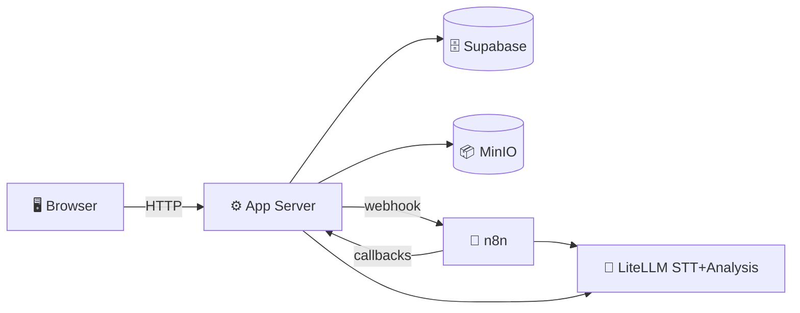
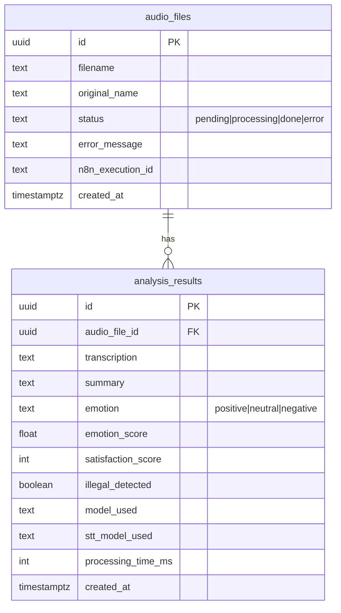
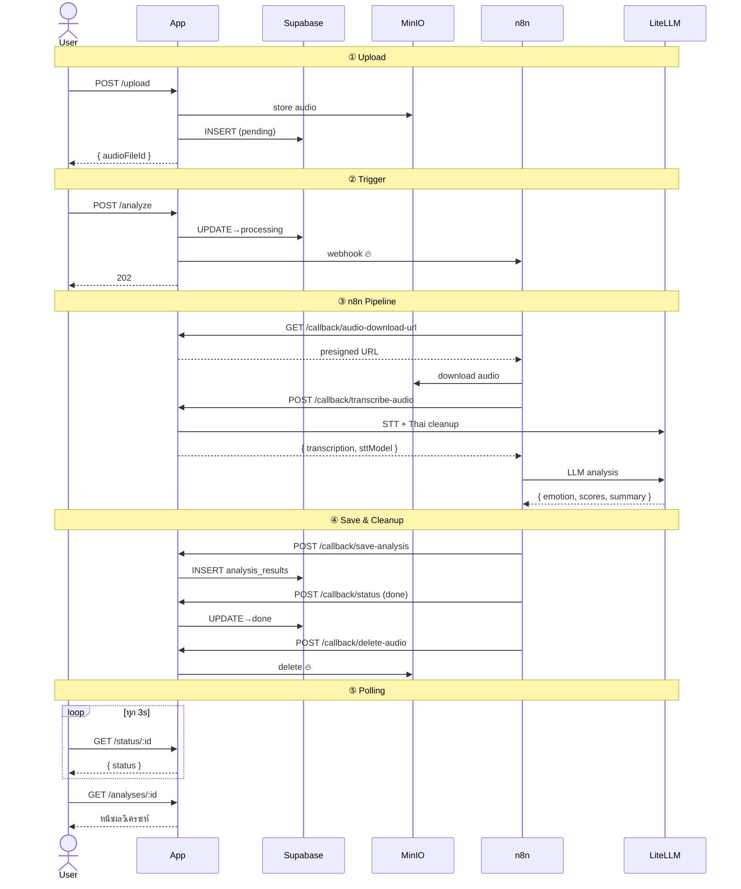
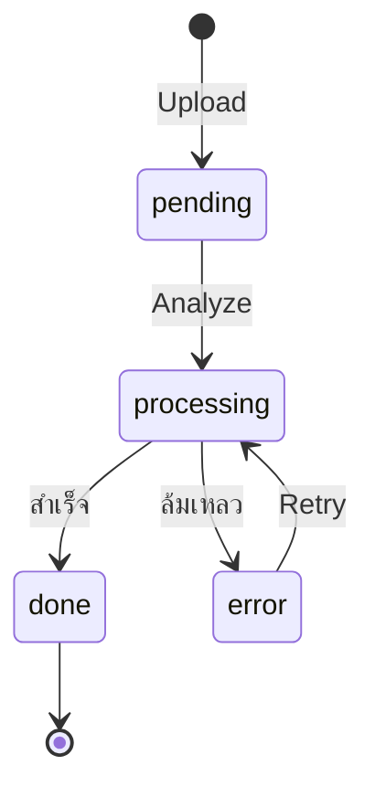

# Voice Analysis — Diagrams (Simplified)

> Mermaid diagrams แบบเรียบง่าย

---

## 1. System Architecture

```mermaid
flowchart LR
    Client["🖥 Browser"] -->|"HTTP"| Server["⚙ App Server"]
    Server --> DB[("🗄 Supabase")]
    Server --> S3[("📦 MinIO")]
    Server -->|"webhook"| N8N["🔄 n8n"]
    N8N -->|"callbacks"| Server
    N8N --> AI["🤖 LiteLLM STT+Analysis"]
    Server --> AI
```

---

## 2. Database Schema

```mermaid
erDiagram
    audio_files ||--o{ analysis_results : has
    audio_files {
        uuid id PK
        text filename
        text original_name
        text status "pending|processing|done|error"
        text error_message
        text n8n_execution_id
        timestamptz created_at
    }
    analysis_results {
        uuid id PK
        uuid audio_file_id FK
        text transcription
        text summary
        text emotion "positive|neutral|negative"
        float emotion_score
        int satisfaction_score
        boolean illegal_detected
        text model_used
        text stt_model_used
        int processing_time_ms
        timestamptz created_at
    }
```

---

## 3. Data Flow

```mermaid
sequenceDiagram
    actor U as User
    participant A as App
    participant D as Supabase
    participant M as MinIO
    participant N as n8n
    participant L as LiteLLM

    Note over U,L: ① Upload
    U->>A: POST /upload
    A->>M: store audio
    A->>D: INSERT (pending)
    A-->>U: { audioFileId }

    Note over U,L: ② Trigger
    U->>A: POST /analyze
    A->>D: UPDATE→processing
    A->>N: webhook 🔥
    A-->>U: 202

    Note over U,L: ③ n8n Pipeline
    N->>A: GET /callback/audio-download-url
    A-->>N: presigned URL
    N->>M: download audio
    N->>A: POST /callback/transcribe-audio
    A->>L: STT + Thai cleanup
    A-->>N: { transcription, sttModel }
    N->>L: LLM analysis
    L-->>N: { emotion, scores, summary }

    Note over U,L: ④ Save & Cleanup
    N->>A: POST /callback/save-analysis
    A->>D: INSERT analysis_results
    N->>A: POST /callback/status (done)
    A->>D: UPDATE→done
    N->>A: POST /callback/delete-audio
    A->>M: delete 🔥

    Note over U,L: ⑤ Polling
    loop ทุก 3s
        U->>A: GET /status/:id
        A-->>U: { status }
    end
    U->>A: GET /analyses/:id
    A-->>U: หน้าผลวิเคราะห์
```

---

## 4. Status Lifecycle

```mermaid
stateDiagram-v2
    [*] --> pending : Upload
    pending --> processing : Analyze
    processing --> done : สำเร็จ
    processing --> error : ล้มเหลว
    error --> processing : Retry
    done --> [*]
```
