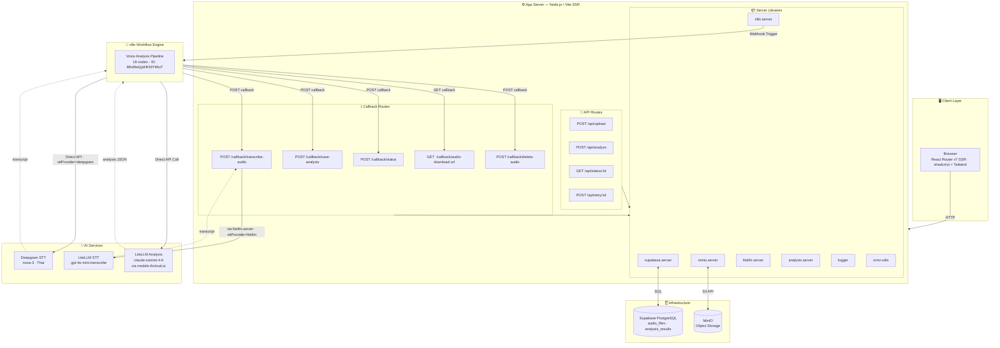
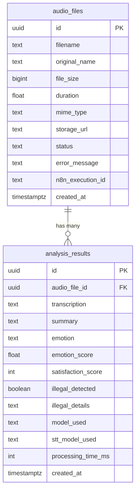
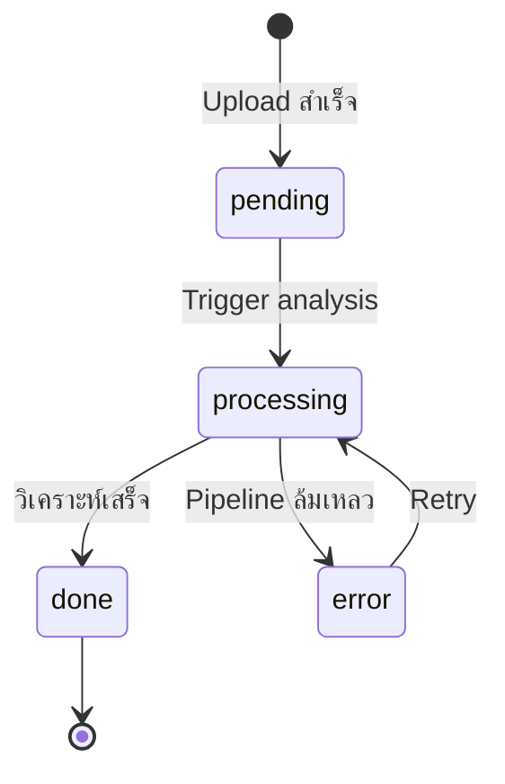
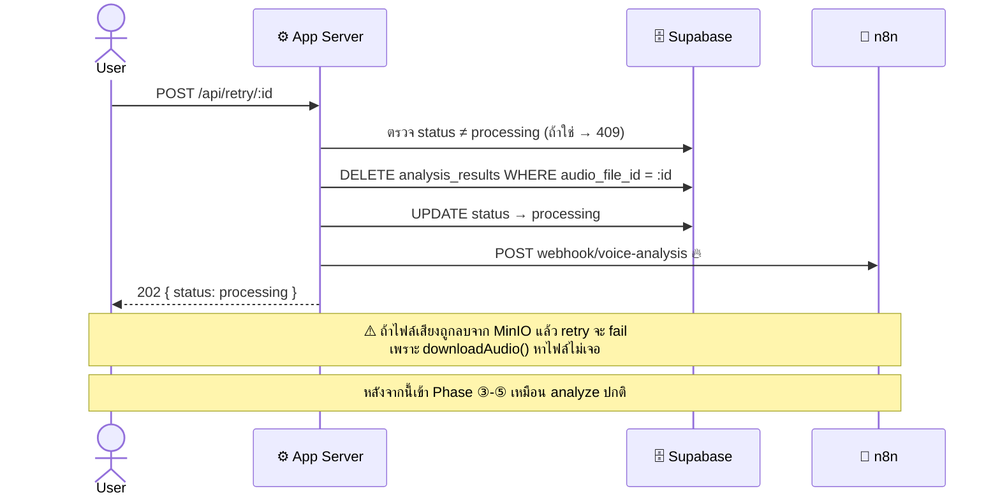
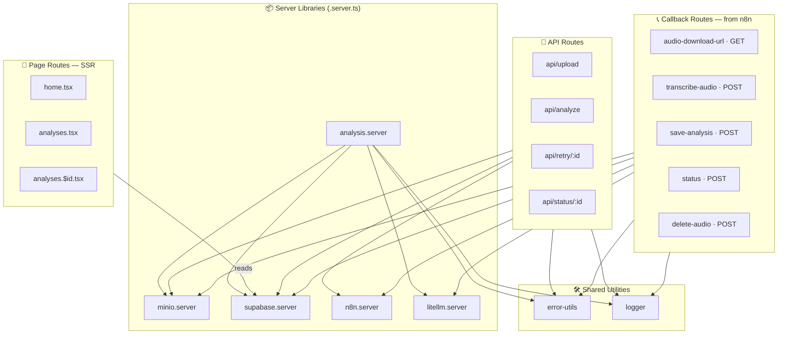

# Voice Analysis — System Diagrams

> ภาพรวมสถาปัตยกรรมและการไหลของข้อมูลทั้งระบบ
> ทุกไดอะแกรมใช้ [Mermaid](https://mermaid.js.org/) syntax — render ได้ใน GitHub, VS Code หรือ Mermaid Live Editor

---

## สารบัญ

1. [System Architecture](#1-system-architecture) — ภาพรวมโครงสร้างระบบ 5 ชั้น
2. [Database Schema](#2-database-schema) — ตารางหลัก 2 ตารางและความสัมพันธ์
3. [Status Lifecycle](#3-status-lifecycle) — วงจรสถานะ audio_files.status
4. [Data Flow — End-to-End](#4-data-flow--end-to-end) — ขั้นตอนทั้งหมดตั้งแต่ upload จนแสดงผล
5. [Retry Flow](#5-retry-flow) — การ retry เมื่อวิเคราะห์ล้มเหลว
6. [Internal Module Dependencies](#6-internal-module-dependencies) — ความสัมพันธ์ระหว่าง module ภายใน

---

## 1. System Architecture

ภาพรวมระบบแบ่งเป็น 5 ชั้น: **Client → App Server → Infrastructure / n8n → AI Services**

---

## 2. Database Schema

ตารางหลัก 2 ตาราง — `audio_files` เก็บข้อมูลไฟล์เสียง, `analysis_results` เก็บผลวิเคราะห์ — ความสัมพันธ์แบบ **1-to-many**

📋 ค่าที่เป็นไปได้ของ field สำคัญ

| Field                      | Values                                       |
| -------------------------- | -------------------------------------------- |
| `audio_files.status`       | `pending` → `processing` → `done` \| `error` |
| `analysis_results.emotion` | `positive` · `neutral` · `negative`          |

---

## 3. Status Lifecycle

วงจรสถานะของ `audio_files.status` ตั้งแต่ upload จนถึง done หรือ error

---

## 4. Data Flow — End-to-End

ขั้นตอนการทำงานทั้งหมด แบ่งเป็น 5 phase

```mermaid
sequenceDiagram
    actor User
    participant App as ⚙️ App Server
    participant DB as 🗄️ Supabase
    participant MinIO as 📦 MinIO
    participant n8n as 🔄 n8n
    participant AI as 🤖 LiteLLM / AI

    rect rgb(30,60,90)
        Note over User,AI: ① Upload
        User->>App: POST /api/upload (audio file)
        App->>MinIO: Upload binary → UUID.ext
        MinIO-->>App: storage_url
        App->>DB: INSERT audio_files (status=pending)
        App-->>User: { audioFileId }
    end

    rect rgb(40,80,60)
        Note over User,AI: ② Trigger Analysis
        User->>App: POST /api/analyze { audioFileId }
        App->>DB: UPDATE status → processing
        App->>n8n: POST webhook/voice-analysis 🔥 fire-and-forget
        App-->>User: 202 { status: processing }
    end

    rect rgb(70,50,30)
        Note over User,AI: ③ n8n Pipeline (background)
        n8n->>App: GET /callback/audio-download-url
        App->>MinIO: Generate presigned URL
        App-->>n8n: { downloadUrl }
        n8n->>MinIO: Download audio
        MinIO-->>n8n: audio binary

        n8n->>App: POST /callback/transcribe-audio
        App->>MinIO: downloadAudio()
        MinIO-->>App: audio buffer
        App->>AI: transcribeAudio() — STT
        AI-->>App: raw transcript
        Note over App: cleanThaiText() + removeRepetitions()
        App-->>n8n: { transcription, sttModel }

        n8n->>AI: POST /chat/completions (analysis)
        AI-->>n8n: { emotion, scores, summary, illegal_* }
    end

    rect rgb(60,30,70)
        Note over User,AI: ④ Save & Cleanup
        n8n->>App: POST /callback/save-analysis
        App->>DB: INSERT analysis_results
        App-->>n8n: { ok, analysisId }

        n8n->>App: POST /callback/status { status: done }
        App->>DB: UPDATE audio_files → done
        App-->>n8n: { ok }

        n8n->>App: POST /callback/delete-audio
        App->>MinIO: deleteAudio()
        App-->>n8n: { ok }
    end

    rect rgb(30,30,70)
        Note over User,AI: ⑤ Client Polling & Display
        loop ทุก 3 วินาที จนกว่า status=done
            User->>App: GET /api/status/:id
            App->>DB: SELECT audio_files + analysis_results
            App-->>User: { status, analysisId? }
        end
        User->>App: GET /analyses/:id (SSR)
        App->>DB: getAudioFileById() + analysis_results
        App-->>User: หน้าผลวิเคราะห์เต็ม
    end
```

---

## 5. Retry Flow

เมื่อวิเคราะห์ล้มเหลว ผู้ใช้สามารถ retry ได้ — ระบบจะลบผลเก่าและเริ่ม pipeline ใหม่

---

## 6. Internal Module Dependencies

ความสัมพันธ์ระหว่าง route, callback, server library และ shared utility ภายในโปรเจกต์

📖 สรุป dependency แต่ละกลุ่ม

| Route Group         | Depends On                                                          |
| ------------------- | ------------------------------------------------------------------- |
| **Pages**           | `supabase.server`                                                   |
| **API Routes**      | `minio` · `supabase` · `n8n` · `error-utils` · `logger`             |
| **Callbacks**       | `minio` · `supabase` · `n8n` · `litellm` · `error-utils` · `logger` |
| **analysis.server** | `minio` · `supabase` · `litellm` · `error-utils` · `logger`         |

